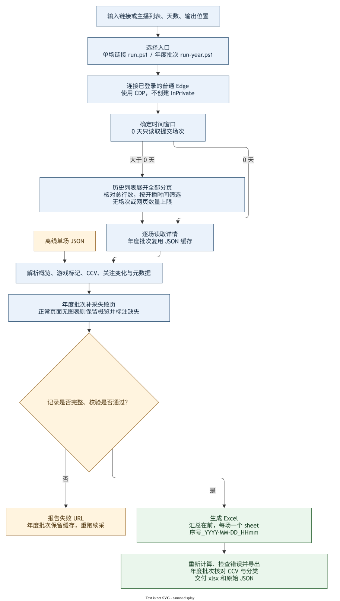

# TwitchTracker Data

读取 TwitchTracker 直播详情及历史场次，输出包含汇总与逐场详情的 Excel。使用普通 Edge 的登录会话；目前仍依赖浏览器。

**采集没有网页数量或场次数量上限。** 历史列表先展开全部 DataTables 分页并核对总行数，再采集指定时间窗口内的记录。窗口、网站实际保留的数据和页面可访问性决定最终覆盖范围。取消数量上限不等于取消页面超时或失败校验。

## 输出文件

- 第一页为 `30天汇总`、`365天汇总` 等窗口汇总。
- 每场一个详情 sheet，名称为 `序号_YYYY-MM-DD_HHmm`，例如 `01_2026-09-19_2345`、`137_2025-09-23_1356`。序号与汇总表一致，日期采用 UTC+8。
- 详情依次包含网页概览、图表数据、页面元数据；保留 CCV 数值表、关注变化、标题变化、游戏统计和来源 URL。Minutes from start、Duration 按一位小数显示，不冻结窗格。
- 单场链接入口把提交场次放在第二页，其余场次倒序；年度入口全部按开始时间倒序。
- 游戏分类取自网页图表游戏标记或唯一的 Played Games 分类，不把直播标题当作游戏名。年度入口遇到正常页面但网站没有图表时，保留概览并标注“网站未提供 CCV 时间序列”；有图表但加载失败仍算失败。

[Dinah 30 天示例](output/examples/dinah_twitchtracker_30d_316084001897.xlsx)

## 运行逻辑



[可编辑 Draw.io 源文件](docs/run-logic.drawio) · [PNG 版](docs/run-logic.drawio.png)

图由 Draw.io Desktop 从同一份 `.drawio` 导出。年度采集的缓存、补采和覆盖校验见 [全年采集说明](YEAR-COLLECTION.md)。

## 环境准备

需要 Windows、PowerShell、Edge、Node.js，以及可导入的 `playwright` 和 `@oai/artifact-tool`。可选 Python 仅用于读取导出文件进行独立校验。

当前 PowerShell 启动脚本使用 Codex 提供的运行环境：

```text
%USERPROFILE%\.cache\codex-runtimes\codex-primary-runtime\dependencies\node\bin\node.exe
```

`@oai/artifact-tool` 是此环境提供的 Excel 库，本仓库不附带该库，不能假设普通 `npm install` 就能配置完整。换设备时，先让可访问本地终端的 AI 工具检查运行环境；若缺少该库，需要先配置提供该库的环境。仅安装浏览器或登录 Twitch 不足以运行整个项目。

在项目根目录连接已有依赖（已存在 `node_modules` 时不要覆盖）：

```powershell
$dependencies = Join-Path $env:USERPROFILE '.cache\codex-runtimes\codex-primary-runtime\dependencies\node\node_modules'
if (!(Test-Path -LiteralPath '.\node_modules')) {
  New-Item -ItemType Junction -Path '.\node_modules' -Target $dependencies
}
$nodeRuntime = Join-Path $env:USERPROFILE '.cache\codex-runtimes\codex-primary-runtime\dependencies\node\bin\node.exe'
& $nodeRuntime --input-type=module -e "await import('playwright'); await import('@oai/artifact-tool'); console.log('依赖正常')"
```

若已自行配置 Node 和上述库，也可以使用后文的 `node` 命令，不必使用 PowerShell 包装脚本。

## 使用已登录的普通 Edge

先保存浏览器工作并正常退出 Edge，再用原有用户资料目录和远程调试端口启动。不要强制结束浏览器，不要使用 InPrivate。示例中的 `Default` 需与实际已登录资料对应。

```powershell
& 'C:\Program Files (x86)\Microsoft\Edge\Application\msedge.exe' --remote-debugging-port=9222 --user-data-dir="$env:LOCALAPPDATA\Microsoft\Edge\User Data" --profile-directory=Default
Invoke-RestMethod 'http://127.0.0.1:9222/json/version'
```

打开 TwitchTracker，确认详情页正常显示。若端口不可用，先核对 Edge 路径、配置目录和远程调试是否生效。网站验证需要在普通浏览器中完成；登录 Twitch 不保证 TwitchTracker 页面一定可访问。采集时避免手动切换采集页，也不要同时运行两个导航采集进程。

## 单场或任意天数

在克隆后的项目根目录运行：

```powershell
.\run.ps1 'https://twitchtracker.com/dinah/streams/316084001897' -Days 0 -CdpUrl 'http://127.0.0.1:9222'
.\run.ps1 'https://twitchtracker.com/dinah/streams/316084001897' -Days 30 -CdpUrl 'http://127.0.0.1:9222'
.\run.ps1 'https://twitchtracker.com/dinah/streams/316084001897' -Days 90 -CdpUrl 'http://127.0.0.1:9222'
.\run.ps1 'https://twitchtracker.com/dinah/streams/316084001897' -Days 180 -CdpUrl 'http://127.0.0.1:9222'
```

`Days` 支持非负整数，0 表示仅提交场次，其它值以**提交场次开播时刻向前回溯**，不是从今天向前计算。默认 30 天，默认写入 `output/`；可用 `-OutputDir` 指定位置。`-Quick` 仅跳过预览渲染，不减少场次或工作表。

此入口历史详情失败会报告 URL 并终止完整窗口导出，不静默把部分结果称为全量。大量跨年数据推荐年度入口，它支持缓存与补采。

等效 Node 命令：

```powershell
node src/cli.mjs 'https://twitchtracker.com/dinah/streams/316084001897' --days 30 --cdp-url http://127.0.0.1:9222 --out-dir output
```

已有本项目兼容的单场原始 JSON，可离线导出：

```powershell
.\run.ps1 -InputJson '.\capture.json' -Quick
```

输入 JSON 代表一个场次，自动按 0 天处理。任意网页 JSON 不一定满足解析器格式。

## sayu、Dinah、Lucypyre 年度批次

```powershell
# 续跑 2026-09-22 批次；只重试 sayu 时加 -Channels sayu
.\run-year.ps1

# 新目录代表新批次，以首次运行时刻向前计算 365 天
.\run-year.ps1 -OutputDir 'output/year-new-batch'
```

默认处理 sayu、dinah、lucypyre，可用 `-Channels` 选择其中一个或多个。每批次的 `window.json` 固定首次运行窗口；同一目录再次运行属于续采，不会自动滚动窗口。需要最新年度窗口时，选择新的输出目录。缓存场次（包括之前的直播快照）不会自动刷新。

每个主播一个 Excel；`listing.json` 保存完整历史索引，逐场 JSON 保存页面原始数据，`prepared.json` 保存最终覆盖与缺失说明。主流程为采集、整理、补采、再次整理、校验、导出。详见 [全年采集说明](YEAR-COLLECTION.md)。

## 如何与 Codex 或其他 AI 工具交流来运行项目

选择能读取本地仓库、运行终端命令的工具，例如 Codex 或 Claude Code。只有聊天能力、无法访问本机文件和 Edge 的工具，只能解释命令，不能直接完成本地采集。操作方法和数据规则在本仓库内，不依赖之前的对话。

给 AI 的任务中写明项目路径、链接或主播、时间窗口的基准、输出位置、是否续采，以及使用哪个普通 Edge 会话。可直接复制以下提示并替换路径：

```text
在 <项目绝对路径> 下工作。先阅读 README.md 和 YEAR-COLLECTION.md，检查 Node、
Playwright、artifact-tool 与 http://127.0.0.1:9222 是否可用。
复用已登录的普通 Edge，不新建 InPrivate，不清除登录资料，不同时启动多个采集进程。
采集 https://twitchtracker.com/dinah/streams/316084001897 向前 90 天的全部场次。
不限制网页数量。输出到 output/dinah-90d；每场一个 sheet，名称包含序号和完整年月日。
执行采集和导出，核对历史列表覆盖、场次 URL、CCV 数值、游戏分类及 sheet 编号。
失败要报告具体 URL 和原因，不能伪造数据或把部分结果说成全量。完成后给出 Excel 路径。
```

年度任务示例：

```text
在 <项目绝对路径> 下工作，先阅读 README.md 和 YEAR-COLLECTION.md。
用已登录普通 Edge 的 9222 端口，采集 sayu、dinah、lucypyre 从本次运行时刻
向前 365 天的全部场次。使用 run-year.ps1，输出到一个新的批次目录。
若目录已经存在，先读取 window.json 确认这是我要续采的窗口。
保留原始 JSON 和失败记录；补采后再校验和导出。报告每位主播应采、已采场次数，
网站无 CCV 的场次，以及直播中快照。不要未经要求推送 GitHub 或上传登录资料。
```

仅调整格式时，明确告诉 AI“复用缓存，只重新导出，不重新访问网页”。网络或网站验证阻塞时，让它报告已完成数量和剩余 URL，并在浏览器恢复后续采。

## 验证与维护

```powershell
node --test tests/history.test.mjs
node src/prepare-year.mjs
node src/verify-year.mjs
node --max-old-space-size=8192 src/export-year.mjs
python src/verify-year-xlsx.py
```

这些年度命令默认读取 `output/year-2026-09-22`。其它目录先设置 `$env:TWITCHTRACKER_BATCH_DIR = '<批次绝对路径>'`。Python 校验检查实际保存的 sheet 名称、数量、CCV 数值、游戏分类、图表数量和冻结窗格。

仓库保留代码、运行图和小型示例；批量缓存、个人浏览器资料及登录 Cookie 不提交。两个同步仓库为 [puhbvuio-lab](https://github.com/puhbvuio-lab/twitchtracker-data) 和 [kirayoushikake](https://github.com/kirayoushikake/twitchtracker-data)。
